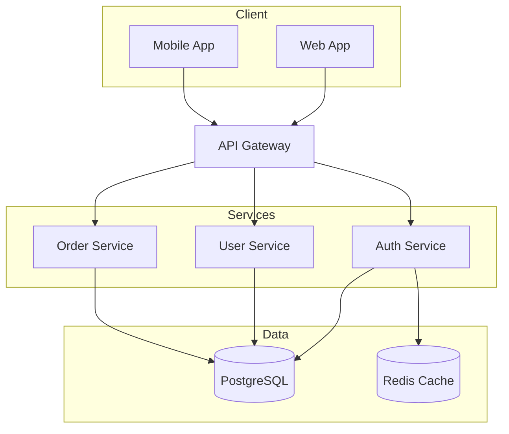
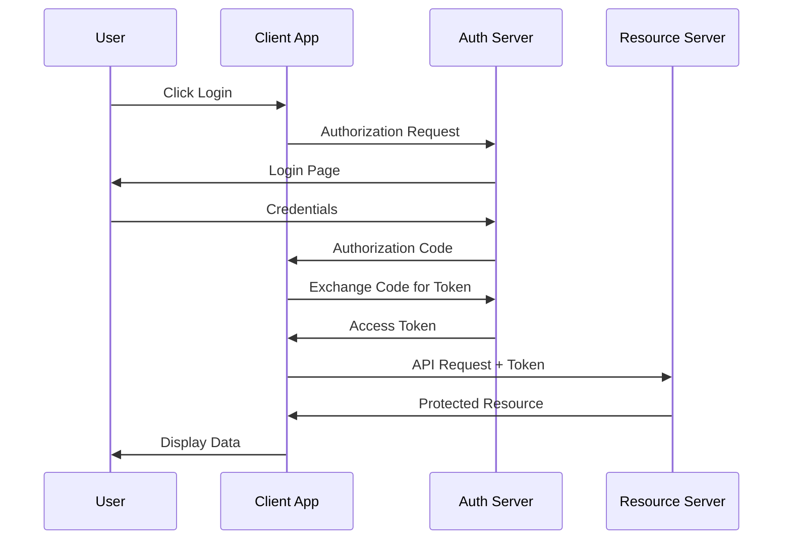
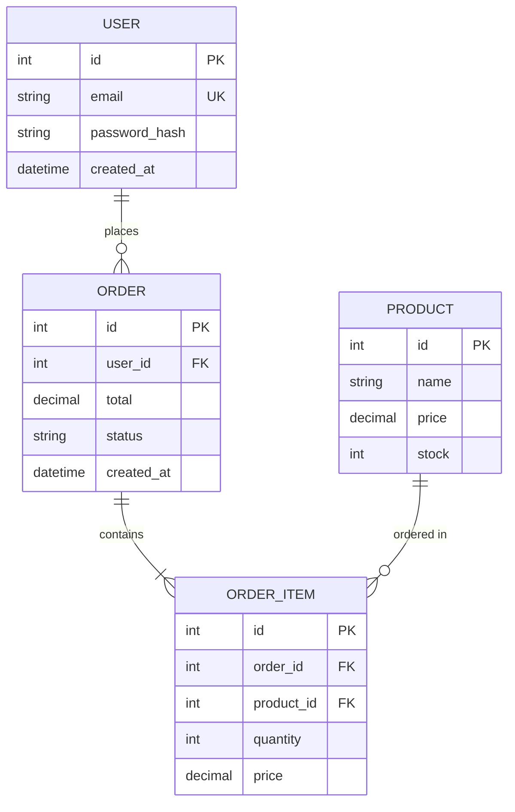

# /diagram - Mermaid Documentation Diagrams (v2.26)

Generate professional Mermaid diagrams for documentation using the Mermaid MCP.

## Usage

```bash
/diagram "system architecture"
/diagram "user authentication flow" --type sequence
/diagram "database schema" --type erDiagram --save docs/schema.svg
@diagram "API endpoints" --type flowchart
```

## Execution

When `/diagram` is invoked:

### Step 1: Analyze Description

Parse the description to determine:
- Diagram type (auto-detect or use --type)
- Key components to visualize
- Relationships between components

### Step 2: Generate Mermaid Code

Based on description, generate appropriate Mermaid syntax:

```yaml
mcp__mermaid__mermaid_preview:
  diagram: |
    <generated_mermaid_code>
  preview_id: "<unique_id>"
  theme: "default"
  width: 800
  height: 600
```

### Step 3: Validate and Save (Optional)

If `--save` is specified, **SECURITY VALIDATION IS MANDATORY**:

#### Path Security Checks (CWE-22 Prevention)

Before saving, validate the path:

1. **REJECT absolute paths** - Must be relative to project root
2. **REJECT path traversal** - No `..` components allowed
3. **RESTRICT to allowed directories** - Only `docs/`, `assets/`, `images/`, `.github/`
4. **ASK user confirmation** for any unusual paths

```yaml
# SECURITY: Validate path BEFORE saving
# Check 1: Reject absolute paths
if path.startswith('/') or path.startswith('~'):
  ERROR: "Absolute paths not allowed. Use relative paths like 'docs/diagram.svg'"

# Check 2: Reject path traversal
if '..' in path:
  ERROR: "Path traversal not allowed. Use paths within project root."

# Check 3: Validate allowed directories
allowed_prefixes: ["docs/", "assets/", "images/", ".github/"]
if not any(path.startswith(p) for p in allowed_prefixes):
  ASK_USER: "Save to '${path}'? This is outside standard documentation directories."

# Check 4: Only proceed if validated
mcp__mermaid__mermaid_save:
  preview_id: "<same_id>"
  save_path: "<validated_path>"  # MUST pass security checks
  format: "svg"
```

## Supported Diagram Types

| Type | Use Case | Example |
|------|----------|---------|
| `flowchart` | Process flows, decision trees | Architecture, workflows |
| `sequence` | Interactions over time | API calls, user flows |
| `classDiagram` | OOP structures | Domain models |
| `erDiagram` | Database schemas | Entity relationships |
| `stateDiagram` | State machines | Component states |
| `gantt` | Project timelines | Sprint planning |
| `pie` | Distribution data | Usage stats |
| `mindmap` | Brainstorming | Feature planning |
| `gitGraph` | Branch visualization | Git workflows |

## Auto-Detection Keywords

| Keywords | Detected Type |
|----------|---------------|
| "flow", "process", "architecture" | flowchart |
| "sequence", "interaction", "call" | sequence |
| "class", "object", "inheritance" | classDiagram |
| "database", "schema", "entity" | erDiagram |
| "state", "transition", "status" | stateDiagram |
| "timeline", "schedule", "sprint" | gantt |
| "distribution", "percentage" | pie |
| "ideas", "brainstorm", "concepts" | mindmap |
| "branch", "merge", "commit" | gitGraph |

## Examples

### Architecture Diagram

```
/diagram "microservices architecture with API gateway, auth service, and database"
```

Generates:


### Sequence Diagram

```
/diagram "OAuth2 authentication flow" --type sequence
```

Generates:


### ER Diagram

```
/diagram "user orders database schema" --type erDiagram --save docs/db-schema.svg
```

Generates:


## Theme Options

| Theme | Description |
|-------|-------------|
| `default` | Light theme (default) |
| `forest` | Green nature theme |
| `dark` | Dark mode |
| `neutral` | Minimal grayscale |

```
/diagram "flow" --theme dark --save docs/flow-dark.svg
```

## Integration with Documentation

This command is designed for **documentation generation only**, not for skills or custom commands. Use cases:

- README architecture diagrams
- API documentation flow charts
- Database schema visualizations
- Process documentation
- Onboarding guides

## CLI Alternative

```bash
ralph diagram "architecture" --type flowchart
ralph diagram "auth flow" --save docs/auth.svg
```

## Related Commands

- `/browse` - Capture screenshots for documentation
- `/image-analyze` - Analyze existing diagrams
- `/retrospective` - Generate improvement flow diagrams
